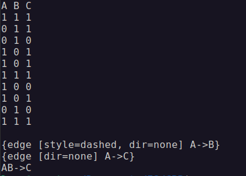

# General Unary Hypotheses Automaton

GUHA - это метод автоматической генерации гипотиз на основе эмпирических данных, то есть дата майнинга. Формируемые методом ответы из себя представляют код на языке dot, помещаемый в *graphviz* и формирующий граф взаимосвязей. Хотя это необязательно и можно вывести все в письменном виде.

#### Инструкция по эксплуатации

Для получения необходимых результатов нужно:

1. Заполнить вектор **nodes** числовыми значениями (атрибуты зашифрованы в бинарной форме числа),
2. Запустить **mask_gen** с названиями атрибутов (в виде вектора строк),
3. Запустить **guha** (можно с ограничениями),
4. Вывести информацию из вектора **rules**.

#### Описание функциональности

Данная реализация позволяет в открытую изменять параметры системы и вносить данные.

- Вектор nodes и вещественные переменные **all**, **depends**, **character**; поддаются изменению напрямую.
- Вектор **rules** содержит в себе письменное описание всех ассоциаций.
- Вектор **names** и **msk** содержат в себе названия атрибутов и их маски. Однако их лучше заполнять с помощью функции **mask_gen**

Данная функциональность может быть дополнена по необходимости.

Пример вывода: 

#### Теория

GUHA - работает по принципу машины Тьюринга, то есть принимает на вход конвеер чисел и работает с их бинарной структурой. Каждое число является объектом с атрибутами, в роли которых выступают биты. Сами атрибуты вычленяются с помощью масок по формуле \f[ (o \wedge m) \equiv m \f], где m - это маска, а o - объект. Когда система составляет "правило", она считает количество членов содержащих оба, свободных членов множества A, свободных членов множества B, и не содержащих ни одного.

||||
|:---:|:---:|:---:|
| \ | \f[ \phi \f] | \f[ \neg\phi \f] |
|\f[ \psi \f]| \f[ \phi \wedge \psi \f]| \f[ \phi \not\rightarrow \psi \f]|
|\f[ \neg\psi \f]| \f[ \psi \not\rightarrow \phi \f]| \f[ \phi \downarrow \psi \f]|

Метод может работать на основе одной или нескольких из 4 функции, 2 импликационные (могут быть использованы как ассоциативные) и 2 ассоциативные. На данный момент в реализации учавствует **FIMPL**, но его достаточно для выявления характера связей и зависимостей, так ищутся 2 отношения 4х результатов **FIMPL** (ab, ac, bd, cd).

\f[ FIMPL(a, b) = {a \over a+b} : a>all \f]

#### Проблемы текущей реализации

Главной проблемой GUHA можно назвать использование теста Фишера (в этой реализации он не учавствует), который представляет из себя сумму отношений факториалов количества всех элементов. 
\f[ \sum^{min(b,c)}_{i=0}{(a+b)!(a+c)!(b+d)!(c+d)! \over m!(a+i)!(b-i)!(c-i)!(d+i)!} \leq\alpha \f]
Посчитать факториал от миллиарда практически невозможно, но именно столько обычно записей и хранится. А также LIMPL \f[\sum^{r}_{i=a}{\begin{pmatrix}{r \\ i}\end{pmatrix}p^i(1-p)^{r-i}} : r = a+b\f], который также работает с целыми значениями.

Ограничения в 32 атрибута (тип int занимает 4 байта (32 бита)), связанное с тем, что используется бинарная сетка вместо вектора логических значений (bool).

Сложность алгоритма зависит не от количества атрибутов или объектов, а от количества единиц в данных. Чем больше в данных связанных атрибутов, тем дольше система будет их выявлять, поэтому если атрибутов очень много лучше проставить ограничение на функцию guha, к примеру до 3 уровней.

#### Особенности

Метод GUHA является измененным методом Apriori, однако в отличии от Apriori, он считает не только количество конъюнкций, но еще количество коимпликаций и стрелок пирса. Так как во время расчетов работает switch (переадресация на нужную ячейку), система считает с примерно той же скоростью, но при этом вычленяет больше информации, которую можно использовать сразу.

